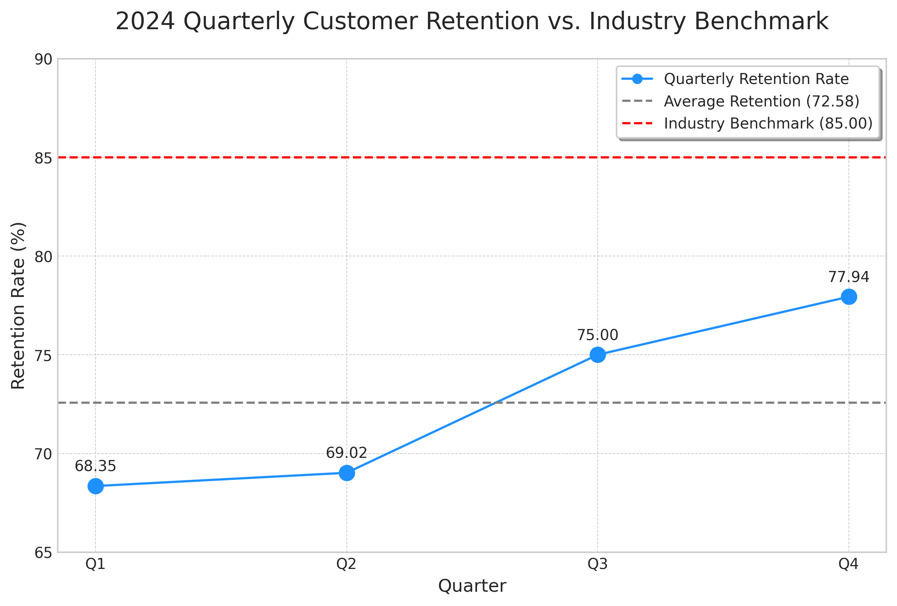

# E-commerce Performance Analysis: Customer Retention Deep Dive

**Contact:** 24f2004824@ds.study.iitm.ac.in

## 1. Executive Summary

This report provides a comprehensive analysis of the company's customer retention rates for the fiscal year 2024. The average retention rate currently stands at **72.58%**, which is significantly below the industry benchmark of **85%**. This data story outlines the key findings from our analysis, discusses the business implications of this trend, and provides actionable recommendations to bridge this gap. The primary recommendation is to **implement targeted retention campaigns** to improve customer loyalty and drive long-term growth.

## 2. Data Analysis and Key Findings

### Quarterly Customer Retention Rate - 2024

| Quarter | Retention Rate (%) |
|---|---|
| Q1 | 68.35 |
| Q2 | 69.02 |
| Q3 | 75.00 |
| Q4 | 77.94 |
| **Average** | **72.58** |

### Key Findings

*   **Underperformance:** Our average retention rate of **72.58%** is **12.42 percentage points** below the industry target of 85%.
*   **Positive Trend:** There was a noticeable improvement in retention rates in the second half of the year, with Q4 showing a **9.59 percentage point** increase from Q1.
*   **Growth Opportunity:** While the upward trend is promising, the current growth rate is insufficient to reach the 85% target without strategic intervention.

## 3. Data Visualization

The following chart illustrates our quarterly retention rates in comparison to the average and the industry benchmark:

## 4. Business Implications

*   **Revenue Impact:** Lower customer retention directly impacts the customer lifetime value (CLV), leading to a long-term revenue decline.
*   **Increased Acquisition Costs:** A leaky bucket forces a higher spend on customer acquisition to maintain growth, reducing marketing ROI.
*   **Competitive Disadvantage:** Falling behind the industry benchmark suggests that competitors are more successful at retaining their customer base, posing a significant threat to our market position.

## 5. Recommendations to Reach the 85% Target

To address the retention gap, we recommend the **implementation of targeted retention campaigns**. This strategic initiative should be rolled out in phases:

### Phase 1: Customer Segmentation and Personalization (30-60 days)

*   **Identify Key Segments:** Analyze customer data to identify high-value, at-risk, and loyal customer segments.
*   **Personalized Communication:** Develop tailored email and social media campaigns with personalized offers and content for each segment.

### Phase 2: Loyalty Program and Enhanced Customer Experience (60-90 days)

*   **Launch a Loyalty Program:** Introduce a tiered loyalty program that rewards repeat purchases and customer advocacy.
*   **Improve Onboarding:** Enhance the new customer onboarding process to ensure a seamless and engaging initial experience.

### Phase 3: Proactive Engagement and Feedback Loop (90-120 days)

*   **Proactive Support:** Implement a proactive customer support system to address potential issues before they escalate.
*   **Feedback Channels:** Create accessible channels for customer feedback to continuously improve our products and services.

By implementing these targeted retention strategies, we can expect to see a significant improvement in customer loyalty, driving our retention rate towards the 85% industry benchmark.
